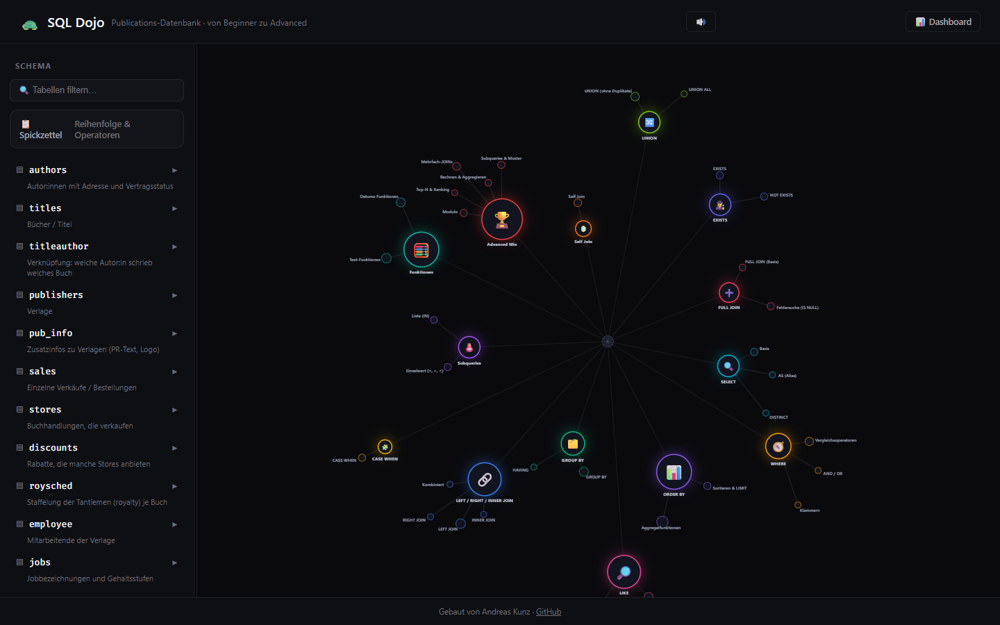

# SQL Dojo — interaktives SQL-Lerntool

Ein browserbasiertes SQL-Übungstool, das reale Abfragen gegen eine echte Datenbank auswertet —
kein Multiple-Choice und keine vorgefertigten Musterlösungen.

**→ [Live-Demo öffnen](https://agentic-content.github.io/sql-dojo/)** (läuft direkt im Browser, kein Setup nötig)


*Interaktive Themen-Übersicht: jeder Knoten ist ein SQL-Thema, jede Kante eine Unterthema-Technik.*

## Warum dieses Projekt

Beim Lernen von SQL reicht es nicht, Lösungen nachzulesen — man muss selbst Abfragen schreiben und
sofort ehrliches Feedback bekommen. Klassische Lernplattformen prüfen oft nur gegen eine feste
Musterlösung, was bei SQL unfair ist: es gibt fast immer mehrere richtige Wege zum selben Ergebnis.

SQL Dojo löst das anders: **jede eingereichte Abfrage wird tatsächlich gegen die
Publications-Datenbank ausgeführt** und das Ergebnis mit der Erwartung verglichen — nicht der Code,
sondern das tatsächliche Abfrageergebnis entscheidet, ob die Lösung richtig ist.

## Kernfunktionen

- **14 Themen** aus dem klassischen SQL-Curriculum: SELECT/FROM, WHERE, ORDER BY, LIKE/IN, GROUP BY,
  JOINS, CASE WHEN, Subqueries, Funktionen, Advanced Mix, Self Join, UNION, EXISTS, FULL JOIN
- **Wissens-Netz**: interaktive Themenübersicht (siehe Screenshot oben) — zeigt auf einen Blick, wie
  umfangreich ein Thema ist und was schon geübt wurde
- **Echte Auswertung** gegen die echte Datenbank statt Musterlösungs-Raterei
- **Freeplay-Modus**: das Thema bleibt verdeckt, man muss es selbst erkennen
- **Rundgang-Modus**: ein Durchgang durch alle Themen am Stück, mit Level-Auswahl (Anfänger, Profi,
  Specialist, Überrasch mich)
- **Gestuftes Tipp-System** bei Bedarf, statt sofort die Lösung zu verraten
- **Fakten-Check-Modus**: eine Behauptung wird per eigener Query überprüft
- **Persönliches Dashboard** mit Lernfortschritt über alle Themen
- **Schema-Browser** mit Spickzettel direkt im Tool

Reines Übungstool — der Fortschritt wird nur lokal im Browser gespeichert, nirgendwo hochgeladen
oder geteilt.

## Architektur

```
index.html                   Einstiegspunkt, leitet zum Tool weiter
SQL_Dojo_Publications.html   Gesamte Anwendung: UI, SQL-Engine (client-seitig) und Übungslogik
assets/                      Screenshots für die Dokumentation
```

Die Anwendung läuft komplett client-seitig im Browser — die Publications-Datenbank wird beim ersten
Laden einmal geladen und danach lokal ausgeführt. Dadurch funktioniert das Tool nach dem ersten
Aufruf auch offline und ohne Server-Backend.

## Herausforderungen & Lösungen

- **Faire Bewertung ohne feste Musterlösung**: gelöst durch Ergebnisvergleich statt Code-Vergleich —
  jede syntaktisch unterschiedliche, aber inhaltlich korrekte Query wird als richtig erkannt.
- **Motivation ohne Frust**: das gestufte Tipp-System gibt erst nach mehreren Fehlversuchen konkrete
  Hinweise, damit der Lerneffekt erhalten bleibt.
- **Themenvielfalt überschaubar halten**: das Wissens-Netz visualisiert die Struktur, damit Lernende
  nicht in 14 Themen und ihren Unterthemen die Übersicht verlieren.

## Tech-Stack

`JavaScript` · `HTML/CSS` · client-seitige SQL-Engine · `GitHub Pages` für das Hosting

## Nächste Ausbaustufen

- Zusätzliche Datenbanken/Themenwelten neben Publications
- Export des Lernfortschritts (z. B. als CSV)
- Mehrsprachige Oberfläche (Deutsch/Englisch)

---

Teil meines GitHub-Portfolios: [github.com/Agentic-Content](https://github.com/Agentic-Content)
